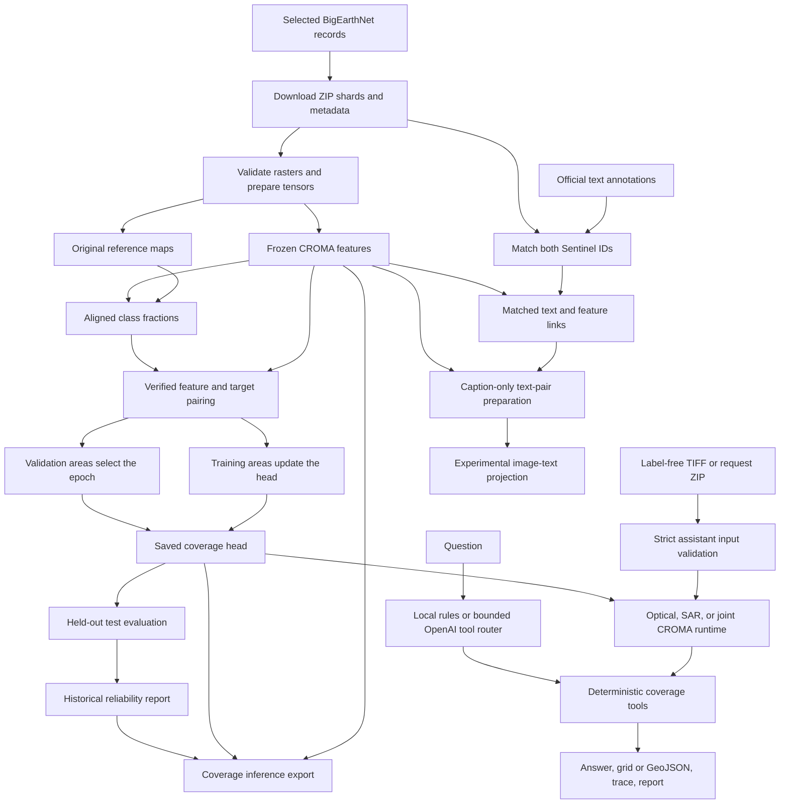

# SatQuery architecture and codebase guide

**Status: 14 September 2026.** This guide describes implemented modules, artifact contracts and extension boundaries for a contributor unfamiliar with the project.

SatQuery combines a file-based training pipeline with a local browser application. The verified
training path is BigEarthNet imagery → CROMA features → land-cover fractions. The inference path
accepts label-free Sentinel imagery → validates and normalizes it → runs CROMA plus a compatible
coverage head → executes a bounded spatial tool → returns evidence, trace, and downloads. A
separate experimental workflow prepares and trains a scene-level image-text projection; no real
trained adapter or validated open-ended language generator is included yet.

## Concepts

| Term | Meaning |
|---|---|
| Area / sample | Paired optical and SAR imagery for approximately 1.2 × 1.2 km, plus metadata/reference map. |
| `patch_id` | BigEarthNet identifier for the entire optical area, not an individual CROMA token. |
| `s1_name` | Metadata identifier for its paired SAR area. |
| Input tensor | Bands stacked on the common 120 × 120 grid: 12 optical or 2 SAR channels. |
| Token / block | One of 225 spatial feature positions, anchored to 8 × 8 input pixels, or 80 × 80 m here. |
| Feature | A learned 768-value representation, with CROMA attention context from the wider scene. |
| Target | Nineteen reference-map class fractions for a block. |
| Coverage head | Trainable linear 768 → 19 or MLP 768 → 256 → 128 → 19 head, separate from frozen CROMA. |
| Annotation | Original text instruction/output linked to the scene or an explicit region. |
| Assistant bundle | Label-free, bounded request ZIP with explicit sensor, date, TIFF, and band-index mappings. |
| Tool trace | Observable selected task/model/tool/parameters/output; it excludes internal model reasoning. |
| Manifest / receipt | JSON recording ordered samples, configuration, source provenance, hashes and completion checks. |

## Implemented data flow



Arrows express dependencies. Reference targets and annotation answers never enter live assistant
inference. Text matching does not train the coverage model. The OpenAI router receives no imagery,
dense grid, or computed answer. Core modules do not mount Drive; notebooks/scripts receive explicit
persistent paths and invoke package functions.

## Repository map

```text
src/satquery/              Reusable processing, models, evaluation and CLIs
src/satquery/assistant/    Label-free runtime, tools, controller, web UI and adaptation/evaluation
src/satquery/_vendor/      Pinned CROMA code, provenance and license
scripts/                  Colab stage orchestration and artifact builders
notebooks/                Generated workflows with embedded package wheels
tests/                    Unit and optional local-data integration tests
reports/pipeline-1000/     Historical small metrics/provenance receipts
reports/assistant/         Portable application integration evidence
docs/                     Guides and historical design notes
pyproject.toml            Dependencies, extras and console entry points
uv.lock                   Local dependency resolution
data/                     Ignored local artifacts; not supplied by a clone
```

The distribution is `satquery-preprocessing`; the import package is `satquery`. Thin CLI files parse arguments while reusable modules own processing.

## Functionality and module ownership

### 1. Select and download imagery

**Modules:** [download_bigearthnet.py](../src/satquery/download_bigearthnet.py), [remote_lmdb.py](../src/satquery/remote_lmdb.py).
**Entry points:** `select_records`, `download_subset`, `write_patch`; CLI `satquery-download-bigearthnet`.

The downloader chooses deterministic country-balanced records within official splits, excludes the original demo areas, obtains selected reference maps and native sensor arrays, reconstructs georeferenced TIFFs and publishes ZIP shards with receipts.

`HTTPRanges` validates byte-range responses. `LMDBReader` reads selected tree/overflow records from the pinned source database. This is a source-specific reader, not a general LMDB replacement. Reconstructed TIFFs use original reference-map georeferencing; headers need not be identical to original archives.

**Artifacts:** `selection.json`, combined `metadata.parquet`, shard ZIPs/receipts, `download.json` and source caches. ZIPs include batch metadata and `download-provenance.json`.

Completed shards are checked and skipped on resume. Different selections require new destinations. Temporary work and persistent output must not overlap.

### 2. Load and normalize raster inputs

**Module:** [preprocessing.py](../src/satquery/preprocessing.py).
**Interfaces:** `ChannelProfile`, `PatchRecord`, `read_records`, `load_raw_patch`, `normalize_patch`, `BigEarthNetCromaDataset`.

`read_records` resolves sensor pairs and optional split/limit selection. `load_raw_patch` checks expected bands, native dimensions, masks, finite values, CRS, bounds and north-up alignment. B02 defines the common 10 m grid. Coarse optical arrays are cast to float32 before bilinear interpolation. SAR retains its current units without an extra log conversion. Reference-map integers are preserved.

`normalize_patch` applies the per-image/channel mean ± 2 sample-standard-deviation, clipping, 8-bit quantization and /255 profile. Constant channels map to 127/255. `BigEarthNetCromaDataset` exposes in-memory samples via PyTorch Dataset.

**Input:** extracted BigEarthNet-S2, BigEarthNet-S1 and Reference_Maps hierarchy plus selected metadata.
**Output:** aligned tensors, reference map, identifiers and provenance. This stage runs no CROMA model.

`preprocessing.py` remains the training-data loader and therefore requires reference maps. Live
assistant inference uses the separate strict Sentinel TIFF loader in
[`assistant/inputs.py`](../src/satquery/assistant/inputs.py). Additional sensor and benchmark
profiles, including Cartosat-2S/RISAT and RGB inputs, remain unsupported.

### 3. Save prepared batches

**Module:** [prepare_croma.py](../src/satquery/prepare_croma.py).
**Entry point:** `export_inputs`; CLI `satquery-prepare-croma`.

Exports bounded batches, checks tensor save/reload equality, preserves order and hashes, and publishes a new output directory. `--raw-only` omits normalized tensors and cannot directly feed the normal feature-export path.

**Artifacts:** per-batch `raw_inputs.pt`, `croma_inputs.pt`, `reference_maps.pt`, `batch.json`; top-level `manifest.json`, `validation.json`. Small selections may store batch files at the root; larger ones use indexed batch directories. Follow manifests rather than assuming layout.

### 4. Extract frozen visual features

**Modules:** [features.py](../src/satquery/features.py), [extract_croma.py](../src/satquery/extract_croma.py), [_vendor/croma.py](../src/satquery/_vendor/croma.py).
**Interfaces:** `CromaFeatureExtractor.from_pretrained`, the extractor's call interface, `extract_features`; CLI `satquery-extract-croma`.

The extractor verifies and loads the pinned official CROMA Base checkpoint, then runs frozen inference. Export validates upstream configuration/hashes and preserves samples/georeferencing. `extract_croma.py` owns only CLI parsing.

Per-batch `features.pt` contains:

| Key | Shape | Meaning |
|---|---|---|
| `optical_encodings` | [N,225,768] | Optical spatial features |
| `SAR_encodings` | [N,225,768] | SAR spatial features |
| `joint_encodings` | [N,225,768] | Fused spatial features |
| `optical_GAP` | [N,768] | Optical mean pooling followed by pretrained head |
| `SAR_GAP` | [N,768] | SAR mean pooling followed by pretrained head |
| `joint_GAP` | [N,768] | Mean-pooled joint spatial features |

Values are raw float32 outputs, not probabilities or text embeddings. The recorded coverage baseline uses `joint_encodings`. The wrapper currently expects paired optical/SAR inputs, even though it saves separate modality outputs.

The vendored model keeps its upstream architecture, license and revision metadata. Weights are external. See [feature API details](croma-features.md).

### 5. Generate aligned class-fraction targets

**Modules:** [targets.py](../src/satquery/targets.py), [prepare_targets.py](../src/satquery/prepare_targets.py).
**Interfaces:** `CLASSES`, `patch_label_targets`, `export_targets`; CLI `satquery-prepare-targets`.

`CLASSES` defines the fixed nineteen-class mapping. The target function divides integer maps into row-major 8 × 8 blocks, computes counts/fractions and tracks unknown/excluded labels. Unexpected codes cause errors. The exporter verifies sample, geometry and feature provenance and adds ground bounds.

The denominator is always 64: 32 forest pixels plus 32 unknown pixels means 50% forest and 50% unknown, not 100% forest. Current head training uses fully labeled blocks only.

**Artifacts:** `targets.pt`, `batch.json`, manifest and validation receipt. Target tensor fields include class counts/fractions, unknown counts/fraction, masks and exported block bounds. See [target contract](patch-targets.md) and the implementation for exact keys.

This creates supervision from reference labels; it does not infer land cover from imagery.

### 6. Validate training and inference artifacts

**Module:** [prediction_data.py](../src/satquery/prediction_data.py).
**Interfaces:** `class_schema`, `feature_contract`, `checked_file`, `FeatureBatches`, `TrainingPairs`.

`FeatureBatches` checks paths, hashes, samples, dimensions and model feature contracts. `TrainingPairs` joins those features with target batches and verifies class/spatial alignment. `iter_batches()` returns samples, features, targets and fully labeled masks; its ordinary iterator serves the original training/demo workflow.

New model consumers should reuse this verified loading boundary instead of independently scanning directories.

### 7. Define and persist the coverage model

**Module:** [prediction.py](../src/satquery/prediction.py).
**Interfaces:** `CoverageHead`, `coverage_loss`, `save_head`, `load_head`.

The default head is `Linear(768,19)`. `CoverageHead(architecture="mlp")` adds two hidden layers (256 and 128), GELU and 0.1 dropout. Checkpoint architecture identifiers select the correct head on reload; legacy linear checkpoints remain compatible. Training uses logits with soft-target cross-entropy; `predict` returns softmax fractions. A head checkpoint contains its state dictionary, dimensions and supplied provenance, not CROMA weights.

Fractions estimate class area. They must not be relabeled as class-presence confidence.

### 8. Train: distinguish the two routes

**Simple route:** [train_prediction.py](../src/satquery/train_prediction.py), CLI `satquery-train-head`.

`train_from_exports` trains verified train-split pairs by default and records fit metrics. `--demo-fit-all` explicitly permits fitting across supplied splits. This route has no validation epoch selection; fit metrics are not held-out performance.

**Validation-selected route:** [validation_training.py](../src/satquery/validation_training.py), `fit_with_validation`.

Accepts separate train/validation `TokenSplit` objects, rejects overlapping image IDs, fits feature scaling on training data only, trains with AdamW and retains the best validation-loss epoch. Constant/nearly constant dimensions use scale 1. Scaling is folded into the first affine layer for either architecture, so inference consumes original features. The same fitting function accepts `architecture="linear"` or `"mlp"`; normalization uses bounded chunks to limit temporary memory. It returns a model and history; callers own saving.

[colab_stage5.py](../scripts/colab_stage5.py) saves the full experiment metadata/model, reload-verifies predictions and writes training/stage receipts. Although the shared loader materializes all splits, only training and validation enter fitting; test data does not select weights or epochs.

**Seeded model comparison:** [compare_heads.py](../src/satquery/compare_heads.py), `run_comparison`.

Reuses the shared loader, fitting, checkpoint and evaluation modules. Fits each architecture with three seeds, saves each completed run for reuse, and locks the architecture/seed decision using validation loss before test evaluation. Produces an experiment-level comparison plus per-seed checkpoints, predictions, metrics and reliability reports. See [nonlinear comparison](nonlinear-comparison.md) for execution and storage details.

### 9. Evaluate held-out coverage

**Module:** [evaluation.py](../src/satquery/evaluation.py).
**Interfaces:** `TokenSplit`, `load_splits`, `predict_rows`, `coverage_metrics`.

`load_splits` uses verified pairs, keeps official area identities and requires eligible tokens in all three splits. **It materializes all selected feature/target tensors in CPU memory.** Full-dataset streaming is not implemented.

Metrics include aggregate/per-class MAE, RMSE and bias in percentage points, errors where a class occurs, support, within-five-point fractions, dominant precision/recall/F1 and confusion matrix. Reference dominant ties are excluded from categorical metrics only. Undefined values are null.

Bootstrap intervals resample whole areas; dependence between different areas remains unmodeled. The 20-area support flag is descriptive, not a statistical guarantee.

[colab_stage6_7.py](../scripts/colab_stage6_7.py) evaluates the frozen head on test areas, compares the train-mean baseline, saves/reloads test predictions before publishing their report, produces CSV/reliability artifacts and verifies inference exports.

### 10. Export predictions and reliability

**Module:** [predict_cover.py](../src/satquery/predict_cover.py).
**Entry point:** `export_predictions`; CLI `satquery-predict-cover`.

Consumes verified feature batches and a compatible head. `predictions.pt` contains `class_fractions [N,225,19]`, `dominant_class [N,225]` and `dominant_fraction [N,225]`. Batch metadata preserves identities and georeferencing; a manifest/validation report records integrity.

Optional historical reliability must match the head digest, feature contract, class order and held-out scope. It is copied into the export with provenance. This is not per-prediction calibration. No targets are required by this module.

### 11. Match annotations and feature links

**Core module:** [match_annotations.py](../src/satquery/match_annotations.py).
**Interface:** `match_annotations`; CLI `python -m satquery.match_annotations` (no registered console shortcut).

Scans the official source Parquet in batches, matches optical IDs and verifies SAR pairs. Checks unique annotation IDs, known splits/types and nonempty text. Keeps original schema/strings and adds `image_split`, `image_index`, `use_partition`, `training_eligible`.

Core outputs:

- `annotations.parquet`: original matched rows plus linkage/eligibility.
- `image-annotations.jsonl`: every selected image, including empty lists for missing text.
- `report.json`: source/selection hashes, counts, missing IDs and conflicts.

Training eligibility requires the image and every annotation to be train. Any benchmark annotation holds out the entire image; other disagreements become conflict holdouts. Missing text is not fabricated.

The source scan is batched, but selected rows remain in memory. This is not constant-memory for arbitrarily large selections.

[colab_download_annotations.py](../scripts/colab_download_annotations.py) downloads and verifies the pinned table. [colab_match_annotations.py](../scripts/colab_match_annotations.py) adds `feature-links.jsonl` by verifying image identities, feature batches, offsets and hashes, then writes the stage-8 receipt. **Feature linking is separate from the matcher CLI.**

These scripts accept the notebook configuration (`P`, `IMAGE_ROOT`, `TEXT_SOURCE`, `OUTPUT`) and derive the selection size from metadata. Source downloads live under `annotations/source/<revision>`; new matched exports go under `annotations/matched`. The source download writes its own verification receipt. See [storage and reuse](code-colab-drive.md).

[audit_annotation_samples.py](../scripts/audit_annotation_samples.py) ports the six-image Colab audit into a standalone diagnostic with explicit paths. It streams the pinned text source, checks image/SAR pairs, reads six reference rasters from the selected ZIP, computes class areas and connected-component box extents, and writes per-claim comparisons and a hash receipt. Its manually transcribed claims apply only to those six images. This does not implement a general grounding parser or model evaluation. The exact historical recipe is retained with the audit report.

The matcher itself does not parse boxes or train a model. The separate scene-level adaptation
workflow described below consumes only verified caption rows; it does not turn bounding boxes into
coverage targets.

### 12. Load label-free assistant inputs

**Module:** [assistant/inputs.py](../src/satquery/assistant/inputs.py).
**Interface:** `load_bundle(path, destination)` returning `InputBundle` and `Observation` records.

This is intentionally separate from `preprocessing.load_raw_patch`, whose training contract includes
reference maps. The assistant loader accepts a bounded ZIP with an explicit `request.json` and TIFF
band mappings. The web guided-upload assembler creates the same contract from named band files or a
user-acknowledged standard-order stack; no second bundle-building implementation is needed.

Validation covers ZIP traversal/links/duplicates and size limits; supported sensor/modality pairs;
exact Sentinel band sets/order; TIFF band indices and driver; masks/finite data; projected metre,
north-up geometry; native/aligned resolution; 1.2 km footprint; pair alignment; and temporal date
order. Output observations hold one normalized `[C,120,120]` tensor, a preview, grid, date, and safe
metadata. Reference maps, targets, and annotations are not accepted as inference inputs.

### 13. Run specialists and deterministic spatial tools

**Modules:** [assistant/runtime.py](../src/satquery/assistant/runtime.py),
[assistant/tools.py](../src/satquery/assistant/tools.py).
**Interfaces:** `CoverageRuntime.analyze`, `CoverageRuntime.analyze_cached`, `execute_task`.

`CoverageRuntime` pins the official CROMA checkpoint hash, lazily loads the required encoder mode,
and checks each head's feature contract before prediction. Optical input needs an
`optical_encodings` head, SAR needs `SAR_encodings`, and an optical–SAR pair needs a
`joint_encodings` head. A missing/incompatible head is a capability error; no random head or
synthetic sensor input is substituted. The cached-feature route reuses `FeatureBatches` and is only
for an explicitly disclosed demo.

The tool registry is fixed to `coverage`, `presence`, `describe`, `locate`, and `change`. Exact
nineteen-class names and four documented aliases are accepted. Location evidence is coarse 80 m
cell GeoJSON transformed to WGS84. Temporal analysis compares two aligned, ordered, same-modality
coverage predictions. It is provisional coverage delta, not a benchmarked change detector.
Outputs are JSON-safe and exclude tensors.

### 14. Route questions and serve the browser application

**Modules:** [assistant/controller.py](../src/satquery/assistant/controller.py),
[assistant/web.py](../src/satquery/assistant/web.py),
[assistant/static/](../src/satquery/assistant/static/).
**Entry point:** CLI `satquery-serve`.

`AssistantController` uses either deterministic local routing or one OpenAI Responses call with
strict function schemas and `store=False`. OpenAI may choose exactly one allowlisted tool and
bounded arguments. It never receives pixels, feature grids, computed results, secrets, or server
paths, and model-authored answer text is discarded. The local tool produces the authoritative
measurements and answer. Authentication/rate-limit/timeout failures are sanitized and surfaced;
there is no silent provider fallback.

`create_app` injects runtime/controller dependencies, serializes heavy inference, bounds multipart
requests, uses opaque result IDs, cleans temporary uploads, and persists only safe report/GeoJSON/
preview artifacts under the configured output directory. It exposes status, advanced ZIP,
guided TIFF, cached demo, and result-download routes. The browser renders untrusted values through
`textContent`, shows capabilities/provider/demo status, a clickable evidence grid, trace,
limitations, and downloads. The server binds to localhost by default and rejects cross-origin API
requests. See [the assistant guide](assistant.md).

### 15. Adapt scene features to text and evaluate tasks

**Modules:** [assistant/text_adaptation.py](../src/satquery/assistant/text_adaptation.py),
[assistant/task_evaluation.py](../src/satquery/assistant/task_evaluation.py).
**Driver:** [colab_adapt_text.py](../scripts/colab_adapt_text.py).

The adaptation path verifies matched captions and `FeatureBatches`, mean-pools the declared spatial
feature, obtains frozen 512-dimensional text embeddings, and trains a 768→256→512 projection.
Only eligible train captions fit weights/retrieval bank; train-only normalization and validation
selection are enforced; test/benchmark/conflict rows cannot train. Prepared semantic records and
splits are cryptographically bound and independently validated at load time. Embedding caches are
content/model/dimension keyed and record bounded credential-free provenance. Similarity is cosine
similarity, not calibrated confidence. No real BigEarthNet.txt adapter has yet been trained.

Task evaluation strictly joins explicit JSONL records and supports `vqa`, `area`, and `change`.
It reports task counts, abstention/coverage, provisional normalized exact match, numerical area and
class-fraction errors, and exact change-label sets without inventing a combined score. Its
compatibility manifest records VRSBench, RSVQA, CDVQA, and the hidden ISRO/SAC evaluation as
unsupported until their adapters, sensor profiles, models, and official scorers exist.

## Orchestration and generated artifacts

| Script under scripts/ | Responsibility |
|---|---|
| `colab_stage1.py` | Verify/extract ZIPs, restore combined metadata, export/recheck tensors |
| `colab_stage2.py` | Extract and verify frozen CROMA outputs |
| `colab_stage3_4.py` | Export targets and independently audit original pixels, all block bounds and class counts |
| `colab_stage5.py` | Validation-selected training, persistence and reports |
| `colab_stage6_7.py` | Test metrics, baseline, reliability and inference verification |
| `colab_download_annotations.py` | Pinned official text download |
| `colab_match_annotations.py` | Text matching, feature linking and stage receipt |
| `colab_adapt_text.py` | Prepare caption pairs, train the experimental projection and report retrieval using saved features |
| `build_download_notebook.py` | Embed the already-built wheel from dist/ |
| `build_pipeline_notebook.py` | Build current wheel and embed stages 1–7 |
| `build_annotation_notebook.py` | Rebuild main pipeline, reuse installer, generate text notebook |
| `build_pipeline_report.py` | Render historical Markdown from local saved reports |
| `colab_update_evaluation.py` | Historical compressed runtime-update helper, not a normal pipeline stage |

Coverage stage scripts use experiment-specific paths/count assertions and should run in notebook order; some reuse in-memory state. Annotation stages use the configuration cell; the six-image diagnostic uses explicit CLI arguments. For other coverage datasets, adapt orchestration or use APIs. Generated notebooks contain package snapshots: changing source requires rebuilding them. They contain no runtime outputs or credentials.

## Contracts, integrity and limitations

- **Order:** metadata/manifests, optical/SAR identities, token order and class schema must agree.
- **Spatial grid:** token index is row ×15 + column. CROMA's 8-pixel anchor is model-specific, not a universal annotation unit.
- **Publishing:** exporters use temporary output/completion checks; respect stage-specific new-output and resume rules.
- **Reuse:** scripts do not automatically invalidate completed outputs when you edit training parameters. Use new experiment directories.
- **Splits:** every question, region and retrieval entry derived from an image must retain its partition. Source annotations are not independent images.
- **Reference fidelity:** rasterized labels are reference evidence, not proof of fine-resolution real-world boundaries.
- **Memory:** preprocessing/feature exports batch work, but validation/evaluation materializes eligible splits and the matcher retains selected rows.
- **Compatibility:** paired BigEarthNet v2 training data and the strict Sentinel assistant profile
  are supported. The assistant accepts aligned same-modality dated pairs for provisional coverage
  deltas. Arbitrary GeoTIFF layouts, missing bands, Cartosat/RISAT, and RGB benchmarks still need
  explicit profiles/adaptation.
- **Inference separation:** assistant requests never load reference maps, target fractions,
  annotations, or answer text. Only validated image tensors enter CROMA.
- **Provider boundary:** OpenAI selects a bounded tool only. Deterministic local code owns every
  reported measurement and answer.
- **Historical reports:** committed reports preserve a completed run, not live application state. Absolute Drive paths in them are provenance.
- **Availability:** datasets, feature exports and trained weights are not in Git. Local lockfile and cloud runtime dependencies are distinct.

## Tests and reading order

| Test file | Main coverage |
|---|---|
| `test_preprocessing.py` | Band order, interpolation, grids/masks and normalization |
| `test_export.py` | Prepared export, reload, batching, selection and overwrite protection |
| `test_features.py` | Feature contracts and extraction/export |
| `test_targets.py` | Taxonomy, mixtures, token ordering and geometry |
| `test_prediction.py` | Learning, pairing, checkpoints and prediction/reliability export |
| `test_evaluation.py` | Splits, validation scaling/training and coverage metrics |
| `test_download.py` | Ranges, LMDB records, resume, sampling and TIFF/shard reconstruction |
| `test_match_annotations.py` | Both-ID matching, duplicates, missing records and partition quarantine |
| `test_assistant_inputs.py` | Label-free ZIP/TIFF contracts, grids, channels, limits and malicious archives |
| `test_assistant_tools.py` | Runtime contracts, coverage/presence/location/description/change evidence |
| `test_assistant_controller.py` | Local and one-call OpenAI routing, strict schemas, trace and sanitized failures |
| `test_assistant_web.py` | Guided/ZIP/demo API, limits, artifact downloads and browser-safe status/content |
| `test_text_adaptation.py` | Split quarantine, artifact binding, cache, projection training and retrieval |
| `test_task_evaluation.py` | Strict record matching, task metrics and compatibility gaps |

See [tests](../tests). Some integration cases require local three-area fixtures and skip without them. The exhaustive cloud raster audit is performed by its Colab script and recorded separately.

Suggested reading order:

1. `preprocessing.py` profiles and `targets.py` taxonomy.
2. `export_inputs`, `extract_features`, `export_targets` artifact boundaries.
3. `prediction_data.py` before writing a new consumer.
4. `CoverageHead`, `fit_with_validation`, `coverage_metrics`.
5. `export_predictions` for current inference.
6. `match_annotations.py` and its Colab feature-linking caller.
7. `assistant/inputs.py`, `runtime.py`, `tools.py`, `controller.py`, then `web.py`.
8. `assistant/text_adaptation.py` and `task_evaluation.py`.
9. Stage scripts and historical reports for the complete experiment.

## Proposed extensions (not implemented)

These are responsibilities under discussion, **not existing modules or finalized filenames**.

| Proposed component | Intended responsibility | Existing input |
|---|---|---|
| Annotation interpretation | Validate boxes/points, class phrases, question meaning and scope | Original annotations and raster geometry |
| Region representation | Preserve grid/coordinates and compare pooling with spatial features | CROMA spatial outputs |
| Presence/area specialist | Calibrate the implemented class/area measurements and thresholds | Coverage predictions |
| Spatial Q&A | Count regions, infer adjacency/relative position | Spatial features and new supervision |
| Text/point grounding | Predict requested boxes from image plus text or point | Features and verified box targets |
| Region recognition/alignment | Learn appearance from verified named regions | Region features and class/phrase pairs |
| Captioning / language adaptation | Train/validate the implemented projection and add a factual generator | Features, text and specialist predictions |
| Metadata specialist | Use permitted dates, coordinates and lookups | Input metadata |
| Optional retrieval | Index training scenes/regions as supporting examples | Features/text and optional learned alignment |
| Change specialist | Replace provisional coverage deltas with benchmarked temporal understanding | New temporal dataset/model |
| Input compatibility | Extend implemented label-free Sentinel validation with benchmark/sensor profiles | Current strict assistant profile |
| Agentic controller | Add benchmark specialists to the implemented bounded registry | Implemented controller/tool registry |
| API/UI | Extend the implemented upload/question/evidence/download UI for deployment | Current local FastAPI application |
| Task-specific uncertainty | Calibrate numerical, presence, grounding and language reliability separately | Validation outputs and held-out checks |

The design direction retains coverage measurement and adds spatial image–language learning. Full grids support scene questions and relationships; explicitly located regions may additionally use pooled features. A reference box can supervise training but cannot be supplied as an answer-bearing crop when testing localization. Missing annotations do not imply absence.

Text annotations do not complete the temporal requirement. Cartosat-2S/RISAT and prescribed
VRSBench/RSVQA/CDVQA inputs need separate compatibility/evaluation implementations. See
[assistant requirement status](assistant.md#sih26167-requirement-status) and
[pending work](../README.md#pending-work).

## Maintenance rules

- Version data/profile changes explicitly and regenerate downstream artifacts.
- Preserve class order, token indexing, modality and checkpoint contracts.
- Retain image-level splits for every derived training/retrieval record.
- Keep weights/data outside Git; commit small receipts and reproducible workflows.
- Rebuild notebooks after source changes; run relevant tests, lint and package build.
- Preserve upstream license/provenance when changing vendored code.
- Update this guide when module ownership changes; describe proposed work as proposed until implemented and evaluated.
# Reusable area-weighted coverage metric

`area_weighted_mae.py` calculates ground-truth area-weighted MAE and scores saved model predictions or complete seeded experiments. `evaluation.py` calls the same function in new reports. See [definition and commands](area-weighted-mae.md). It reuses existing predictions and leaves feature extraction, label preparation, training and model selection unchanged.
