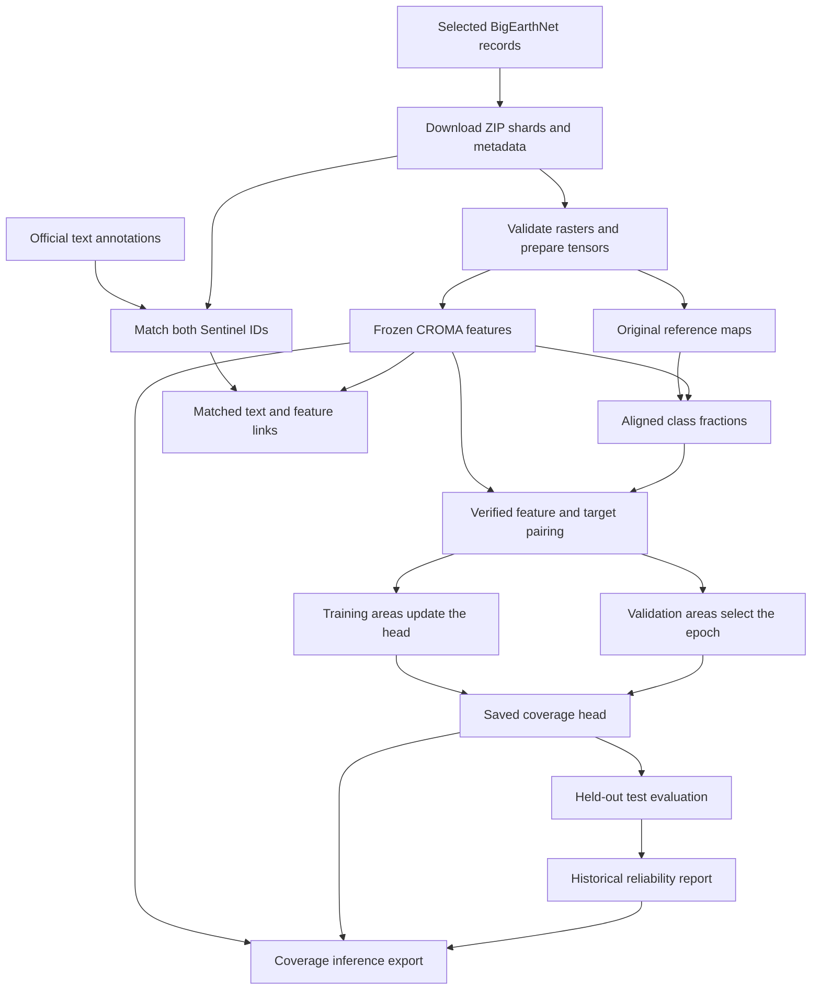

# SatQuery architecture and codebase guide

**Status: 14 September 2026.** This guide describes implemented modules, artifact contracts and extension boundaries for a contributor unfamiliar with the project.

SatQuery is currently a file-based Python pipeline, not a web application. Its verified path is BigEarthNet imagery → CROMA features → land-cover fractions. A separate branch matches text annotations to those same images. There is no trained language model, query controller, application database or API in this version.

## Concepts

| Term | Meaning |
|---|---|
| Area / sample | Paired optical and SAR imagery for approximately 1.2 × 1.2 km, plus metadata/reference map. |
| `patch_id` | BigEarthNet identifier for the entire optical area, not an individual CROMA token. |
| `s1_name` | Metadata identifier for its paired SAR area. |
| Input tensor | Bands stacked on the common 120 × 120 grid: 12 optical or 2 SAR channels. |
| Token / block | One of 225 spatial feature positions, anchored to 8 × 8 input pixels, or 80 × 80 m here. |
| Feature | A learned 768-value representation, with CROMA attention context from the wider scene. |
| Target | Nineteen reference-map class fractions for a block. |
| Coverage head | Trainable linear 768 → 19 or MLP 768 → 256 → 128 → 19 head, separate from frozen CROMA. |
| Annotation | Original text instruction/output linked to the scene or an explicit region. |
| Manifest / receipt | JSON recording ordered samples, configuration, source provenance, hashes and completion checks. |

## Implemented data flow



Arrows express dependencies. Reference targets never enter CROMA or the predictor as inputs. Text matching does not train the coverage model. Core modules do not mount Drive; notebooks do so and invoke package functions through experiment scripts.

## Repository map

```text
src/satquery/              Reusable processing, models, evaluation and CLIs
src/satquery/_vendor/      Pinned CROMA code, provenance and license
scripts/                  Colab stage orchestration and artifact builders
notebooks/                Generated workflows with embedded package wheels
tests/                    Unit and optional local-data integration tests
reports/pipeline-1000/     Historical small metrics/provenance receipts
docs/                     Guides and historical design notes
pyproject.toml            Dependencies, extras and console entry points
uv.lock                   Local dependency resolution
data/                     Ignored local artifacts; not supplied by a clone
```

The distribution is `satquery-preprocessing`; the import package is `satquery`. Thin CLI files parse arguments while reusable modules own processing.

## Functionality and module ownership

### 1. Select and download imagery

**Modules:** [download_bigearthnet.py](../src/satquery/download_bigearthnet.py), [remote_lmdb.py](../src/satquery/remote_lmdb.py).
**Entry points:** `select_records`, `download_subset`, `write_patch`; CLI `satquery-download-bigearthnet`.

The downloader chooses deterministic country-balanced records within official splits, excludes the original demo areas, obtains selected reference maps and native sensor arrays, reconstructs georeferenced TIFFs and publishes ZIP shards with receipts.

`HTTPRanges` validates byte-range responses. `LMDBReader` reads selected tree/overflow records from the pinned source database. This is a source-specific reader, not a general LMDB replacement. Reconstructed TIFFs use original reference-map georeferencing; headers need not be identical to original archives.

**Artifacts:** `selection.json`, combined `metadata.parquet`, shard ZIPs/receipts, `download.json` and source caches. ZIPs include batch metadata and `download-provenance.json`.

Completed shards are checked and skipped on resume. Different selections require new destinations. Temporary work and persistent output must not overlap.

### 2. Load and normalize raster inputs

**Module:** [preprocessing.py](../src/satquery/preprocessing.py).
**Interfaces:** `ChannelProfile`, `PatchRecord`, `read_records`, `load_raw_patch`, `normalize_patch`, `BigEarthNetCromaDataset`.

`read_records` resolves sensor pairs and optional split/limit selection. `load_raw_patch` checks expected bands, native dimensions, masks, finite values, CRS, bounds and north-up alignment. B02 defines the common 10 m grid. Coarse optical arrays are cast to float32 before bilinear interpolation. SAR retains its current units without an extra log conversion. Reference-map integers are preserved.

`normalize_patch` applies the per-image/channel mean ± 2 sample-standard-deviation, clipping, 8-bit quantization and /255 profile. Constant channels map to 127/255. `BigEarthNetCromaDataset` exposes in-memory samples via PyTorch Dataset.

**Input:** extracted BigEarthNet-S2, BigEarthNet-S1 and Reference_Maps hierarchy plus selected metadata.
**Output:** aligned tensors, reference map, identifiers and provenance. This stage runs no CROMA model.

The current loader requires reference maps. A label-free inference loader is a future extension, even though downstream prediction itself needs only features.

### 3. Save prepared batches

**Module:** [prepare_croma.py](../src/satquery/prepare_croma.py).
**Entry point:** `export_inputs`; CLI `satquery-prepare-croma`.

Exports bounded batches, checks tensor save/reload equality, preserves order and hashes, and publishes a new output directory. `--raw-only` omits normalized tensors and cannot directly feed the normal feature-export path.

**Artifacts:** per-batch `raw_inputs.pt`, `croma_inputs.pt`, `reference_maps.pt`, `batch.json`; top-level `manifest.json`, `validation.json`. Small selections may store batch files at the root; larger ones use indexed batch directories. Follow manifests rather than assuming layout.

### 4. Extract frozen visual features

**Modules:** [features.py](../src/satquery/features.py), [extract_croma.py](../src/satquery/extract_croma.py), [_vendor/croma.py](../src/satquery/_vendor/croma.py).
**Interfaces:** `CromaFeatureExtractor.from_pretrained`, the extractor's call interface, `extract_features`; CLI `satquery-extract-croma`.

The extractor verifies and loads the pinned official CROMA Base checkpoint, then runs frozen inference. Export validates upstream configuration/hashes and preserves samples/georeferencing. `extract_croma.py` owns only CLI parsing.

Per-batch `features.pt` contains:

| Key | Shape | Meaning |
|---|---|---|
| `optical_encodings` | [N,225,768] | Optical spatial features |
| `SAR_encodings` | [N,225,768] | SAR spatial features |
| `joint_encodings` | [N,225,768] | Fused spatial features |
| `optical_GAP` | [N,768] | Optical mean pooling followed by pretrained head |
| `SAR_GAP` | [N,768] | SAR mean pooling followed by pretrained head |
| `joint_GAP` | [N,768] | Mean-pooled joint spatial features |

Values are raw float32 outputs, not probabilities or text embeddings. The recorded coverage baseline uses `joint_encodings`. The wrapper currently expects paired optical/SAR inputs, even though it saves separate modality outputs.

The vendored model keeps its upstream architecture, license and revision metadata. Weights are external. See [feature API details](croma-features.md).

### 5. Generate aligned class-fraction targets

**Modules:** [targets.py](../src/satquery/targets.py), [prepare_targets.py](../src/satquery/prepare_targets.py).
**Interfaces:** `CLASSES`, `patch_label_targets`, `export_targets`; CLI `satquery-prepare-targets`.

`CLASSES` defines the fixed nineteen-class mapping. The target function divides integer maps into row-major 8 × 8 blocks, computes counts/fractions and tracks unknown/excluded labels. Unexpected codes cause errors. The exporter verifies sample, geometry and feature provenance and adds ground bounds.

The denominator is always 64: 32 forest pixels plus 32 unknown pixels means 50% forest and 50% unknown, not 100% forest. Current head training uses fully labeled blocks only.

**Artifacts:** `targets.pt`, `batch.json`, manifest and validation receipt. Target tensor fields include class counts/fractions, unknown counts/fraction, masks and exported block bounds. See [target contract](patch-targets.md) and the implementation for exact keys.

This creates supervision from reference labels; it does not infer land cover from imagery.

### 6. Validate training and inference artifacts

**Module:** [prediction_data.py](../src/satquery/prediction_data.py).
**Interfaces:** `class_schema`, `feature_contract`, `checked_file`, `FeatureBatches`, `TrainingPairs`.

`FeatureBatches` checks paths, hashes, samples, dimensions and model feature contracts. `TrainingPairs` joins those features with target batches and verifies class/spatial alignment. `iter_batches()` returns samples, features, targets and fully labeled masks; its ordinary iterator serves the original training/demo workflow.

New model consumers should reuse this verified loading boundary instead of independently scanning directories.

### 7. Define and persist the coverage model

**Module:** [prediction.py](../src/satquery/prediction.py).
**Interfaces:** `CoverageHead`, `coverage_loss`, `save_head`, `load_head`.

The default head is `Linear(768,19)`. `CoverageHead(architecture="mlp")` adds two hidden layers (256 and 128), GELU and 0.1 dropout. Checkpoint architecture identifiers select the correct head on reload; legacy linear checkpoints remain compatible. Training uses logits with soft-target cross-entropy; `predict` returns softmax fractions. A head checkpoint contains its state dictionary, dimensions and supplied provenance, not CROMA weights.

Fractions estimate class area. They must not be relabeled as class-presence confidence.

### 8. Train: distinguish the two routes

**Simple route:** [train_prediction.py](../src/satquery/train_prediction.py), CLI `satquery-train-head`.

`train_from_exports` trains verified train-split pairs by default and records fit metrics. `--demo-fit-all` explicitly permits fitting across supplied splits. This route has no validation epoch selection; fit metrics are not held-out performance.

**Validation-selected route:** [validation_training.py](../src/satquery/validation_training.py), `fit_with_validation`.

Accepts separate train/validation `TokenSplit` objects, rejects overlapping image IDs, fits feature scaling on training data only, trains with AdamW and retains the best validation-loss epoch. Constant/nearly constant dimensions use scale 1. Scaling is folded into the first affine layer for either architecture, so inference consumes original features. The same fitting function accepts `architecture="linear"` or `"mlp"`; normalization uses bounded chunks to limit temporary memory. It returns a model and history; callers own saving.

[colab_stage5.py](../scripts/colab_stage5.py) saves the full experiment metadata/model, reload-verifies predictions and writes training/stage receipts. Although the shared loader materializes all splits, only training and validation enter fitting; test data does not select weights or epochs.

**Seeded model comparison:** [compare_heads.py](../src/satquery/compare_heads.py), `run_comparison`.

Reuses the shared loader, fitting, checkpoint and evaluation modules. Fits each architecture with three seeds, saves each completed run for reuse, and locks the architecture/seed decision using validation loss before test evaluation. Produces an experiment-level comparison plus per-seed checkpoints, predictions, metrics and reliability reports. See [nonlinear comparison](nonlinear-comparison.md) for execution and storage details.

### 9. Evaluate held-out coverage

**Module:** [evaluation.py](../src/satquery/evaluation.py).
**Interfaces:** `TokenSplit`, `load_splits`, `predict_rows`, `coverage_metrics`.

`load_splits` uses verified pairs, keeps official area identities and requires eligible tokens in all three splits. **It materializes all selected feature/target tensors in CPU memory.** Full-dataset streaming is not implemented.

Metrics include aggregate/per-class MAE, RMSE and bias in percentage points, errors where a class occurs, support, within-five-point fractions, dominant precision/recall/F1 and confusion matrix. Reference dominant ties are excluded from categorical metrics only. Undefined values are null.

Bootstrap intervals resample whole areas; dependence between different areas remains unmodeled. The 20-area support flag is descriptive, not a statistical guarantee.

[colab_stage6_7.py](../scripts/colab_stage6_7.py) evaluates the frozen head on test areas, compares the train-mean baseline, saves/reloads test predictions before publishing their report, produces CSV/reliability artifacts and verifies inference exports.

### 10. Export predictions and reliability

**Module:** [predict_cover.py](../src/satquery/predict_cover.py).
**Entry point:** `export_predictions`; CLI `satquery-predict-cover`.

Consumes verified feature batches and a compatible head. `predictions.pt` contains `class_fractions [N,225,19]`, `dominant_class [N,225]` and `dominant_fraction [N,225]`. Batch metadata preserves identities and georeferencing; a manifest/validation report records integrity.

Optional historical reliability must match the head digest, feature contract, class order and held-out scope. It is copied into the export with provenance. This is not per-prediction calibration. No targets are required by this module.

### 11. Match annotations and feature links

**Core module:** [match_annotations.py](../src/satquery/match_annotations.py).
**Interface:** `match_annotations`; CLI `python -m satquery.match_annotations` (no registered console shortcut).

Scans the official source Parquet in batches, matches optical IDs and verifies SAR pairs. Checks unique annotation IDs, known splits/types and nonempty text. Keeps original schema/strings and adds `image_split`, `image_index`, `use_partition`, `training_eligible`.

Core outputs:

- `annotations.parquet`: original matched rows plus linkage/eligibility.
- `image-annotations.jsonl`: every selected image, including empty lists for missing text.
- `report.json`: source/selection hashes, counts, missing IDs and conflicts.

Training eligibility requires the image and every annotation to be train. Any benchmark annotation holds out the entire image; other disagreements become conflict holdouts. Missing text is not fabricated.

The source scan is batched, but selected rows remain in memory. This is not constant-memory for arbitrarily large selections.

[colab_download_annotations.py](../scripts/colab_download_annotations.py) downloads and verifies the pinned table. [colab_match_annotations.py](../scripts/colab_match_annotations.py) adds `feature-links.jsonl` by verifying image identities, feature batches, offsets and hashes, then writes the stage-8 receipt. **Feature linking is separate from the matcher CLI.**

Not performed: box parsing, token overlap, region pooling, phrase resolution, image–text alignment, retrieval or language training.

## Orchestration and generated artifacts

| Script under scripts/ | Responsibility |
|---|---|
| `colab_stage1.py` | Verify/extract ZIPs, restore combined metadata, export/recheck tensors |
| `colab_stage2.py` | Extract and verify frozen CROMA outputs |
| `colab_stage3_4.py` | Export targets and independently audit original pixels, all block bounds and class counts |
| `colab_stage5.py` | Validation-selected training, persistence and reports |
| `colab_stage6_7.py` | Test metrics, baseline, reliability and inference verification |
| `colab_download_annotations.py` | Pinned official text download |
| `colab_match_annotations.py` | Text matching, feature linking and stage receipt |
| `build_download_notebook.py` | Embed the already-built wheel from dist/ |
| `build_pipeline_notebook.py` | Build current wheel and embed stages 1–7 |
| `build_annotation_notebook.py` | Rebuild main pipeline, reuse installer, generate text notebook |
| `build_pipeline_report.py` | Render historical Markdown from local saved reports |
| `colab_update_evaluation.py` | Historical compressed runtime-update helper, not a normal pipeline stage |

Stage scripts use fixed Colab paths/count assertions and should run in notebook order; some reuse in-memory state. For other datasets, adapt orchestration or use APIs. Generated notebooks contain package snapshots: changing source requires rebuilding them. They contain no runtime outputs or credentials.

## Contracts, integrity and limitations

- **Order:** metadata/manifests, optical/SAR identities, token order and class schema must agree.
- **Spatial grid:** token index is row ×15 + column. CROMA's 8-pixel anchor is model-specific, not a universal annotation unit.
- **Publishing:** exporters use temporary output/completion checks; respect stage-specific new-output and resume rules.
- **Reuse:** scripts do not automatically invalidate completed outputs when you edit training parameters. Use new experiment directories.
- **Splits:** every question, region and retrieval entry derived from an image must retain its partition. Source annotations are not independent images.
- **Reference fidelity:** rasterized labels are reference evidence, not proof of fine-resolution real-world boundaries.
- **Memory:** preprocessing/feature exports batch work, but validation/evaluation materializes eligible splits and the matcher retains selected rows.
- **Compatibility:** paired BigEarthNet v2 inputs are supported. Arbitrary GeoTIFF layouts, missing bands, Cartosat/RISAT, RGB benchmarks and temporal pairs need explicit profiles/adaptation.
- **Historical reports:** committed reports preserve a completed run, not live application state. Absolute Drive paths in them are provenance.
- **Availability:** datasets, feature exports and trained weights are not in Git. Local lockfile and cloud runtime dependencies are distinct.

## Tests and reading order

| Test file | Main coverage |
|---|---|
| `test_preprocessing.py` | Band order, interpolation, grids/masks and normalization |
| `test_export.py` | Prepared export, reload, batching, selection and overwrite protection |
| `test_features.py` | Feature contracts and extraction/export |
| `test_targets.py` | Taxonomy, mixtures, token ordering and geometry |
| `test_prediction.py` | Learning, pairing, checkpoints and prediction/reliability export |
| `test_evaluation.py` | Splits, validation scaling/training and coverage metrics |
| `test_download.py` | Ranges, LMDB records, resume, sampling and TIFF/shard reconstruction |
| `test_match_annotations.py` | Both-ID matching, duplicates, missing records and partition quarantine |

See [tests](../tests). Some integration cases require local three-area fixtures and skip without them. The exhaustive cloud raster audit is performed by its Colab script and recorded separately.

Suggested reading order:

1. `preprocessing.py` profiles and `targets.py` taxonomy.
2. `export_inputs`, `extract_features`, `export_targets` artifact boundaries.
3. `prediction_data.py` before writing a new consumer.
4. `CoverageHead`, `fit_with_validation`, `coverage_metrics`.
5. `export_predictions` for current inference.
6. `match_annotations.py` and its Colab feature-linking caller.
7. Stage scripts and historical reports for the complete experiment.

## Proposed extensions (not implemented)

These are responsibilities under discussion, **not existing modules or finalized filenames**.

| Proposed component | Intended responsibility | Existing input |
|---|---|---|
| Annotation interpretation | Validate boxes/points, class phrases, question meaning and scope | Original annotations and raster geometry |
| Region representation | Preserve grid/coordinates and compare pooling with spatial features | CROMA spatial outputs |
| Presence/area specialist | Interpret classes/areas, run measurements and calibrated thresholds | Coverage predictions |
| Spatial Q&A | Count regions, infer adjacency/relative position | Spatial features and new supervision |
| Text/point grounding | Predict requested boxes from image plus text or point | Features and verified box targets |
| Region recognition/alignment | Learn appearance from verified named regions | Region features and class/phrase pairs |
| Captioning / language adaptation | Generate current-image descriptions from spatial and numerical evidence | Features, text and specialist predictions |
| Metadata specialist | Use permitted dates, coordinates and lookups | Input metadata |
| Optional retrieval | Index training scenes/regions as supporting examples | Features/text and optional learned alignment |
| Change specialist | Understand genuine aligned dated pairs | New temporal dataset/model |
| Input compatibility | Label-free inference and sensor/benchmark profiles | Current strict preprocessing profile |
| Agentic controller | Validate queries/inputs, execute permitted tools, combine evidence and report actions | Implemented specialist registry |
| API/UI | Upload, questions, selected regions, overlays and downloadable reports | Future backend/controller |
| Task-specific uncertainty | Calibrate numerical, presence, grounding and language reliability separately | Validation outputs and held-out checks |

The design direction retains coverage measurement and adds spatial image–language learning. Full grids support scene questions and relationships; explicitly located regions may additionally use pooled features. A reference box can supervise training but cannot be supplied as an answer-bearing crop when testing localization. Missing annotations do not imply absence.

Text annotations do not complete the temporal requirement. Cartosat-2S/RISAT and prescribed VRSBench/RSVQA/CDVQA inputs need separate compatibility/evaluation decisions. See [pending work](../README.md#pending-work).

## Maintenance rules

- Version data/profile changes explicitly and regenerate downstream artifacts.
- Preserve class order, token indexing, modality and checkpoint contracts.
- Retain image-level splits for every derived training/retrieval record.
- Keep weights/data outside Git; commit small receipts and reproducible workflows.
- Rebuild notebooks after source changes; run relevant tests, lint and package build.
- Preserve upstream license/provenance when changing vendored code.
- Update this guide when module ownership changes; describe proposed work as proposed until implemented and evaluated.
